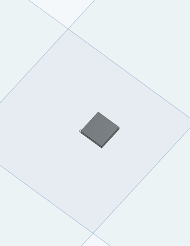
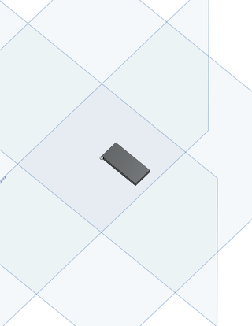

## mechanical-mockup

## Description
The repository will house CAD mock-ups of various components, including the Readout Board. Right now, it holds the following parts from the Readout Board: MUX64, LpGBT, VTRX+, and the Big Capacitors at the top of the board.

## Visuals
Below are the visuals of the CAD files currently in the repository:
MUX64 
 

LpGBT 
 

VTRX+ 
 

big capacitors parts 
 

## Installation
Since I'm using a MacOS to upload and share the models, that is typically the ideal operating system to use. Import the model to Onshape to view.
